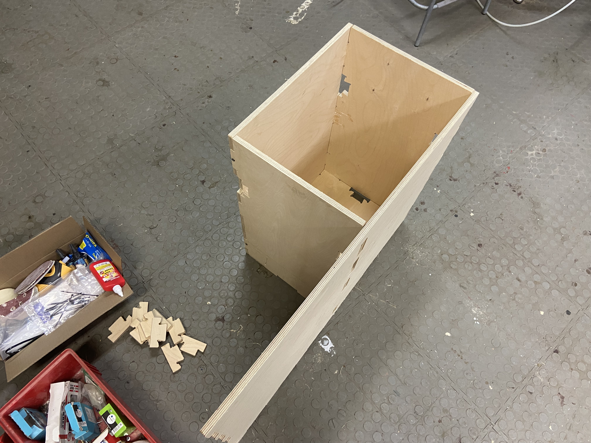
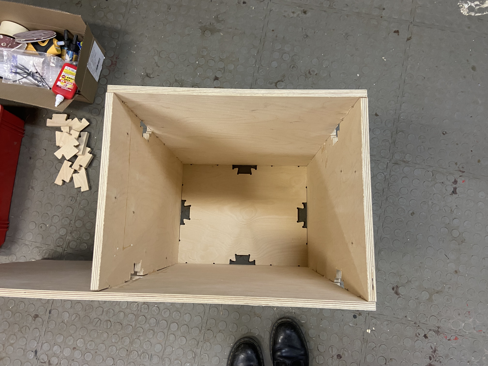
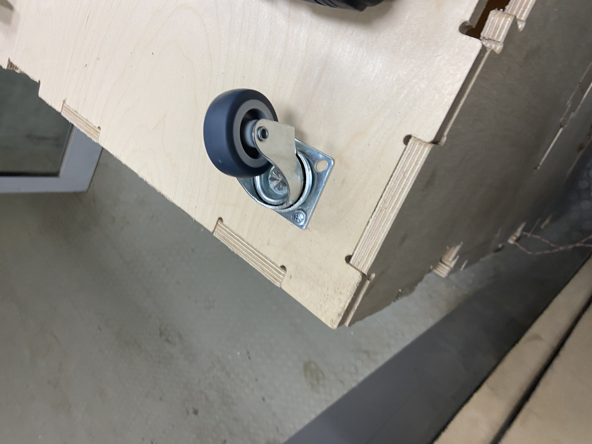
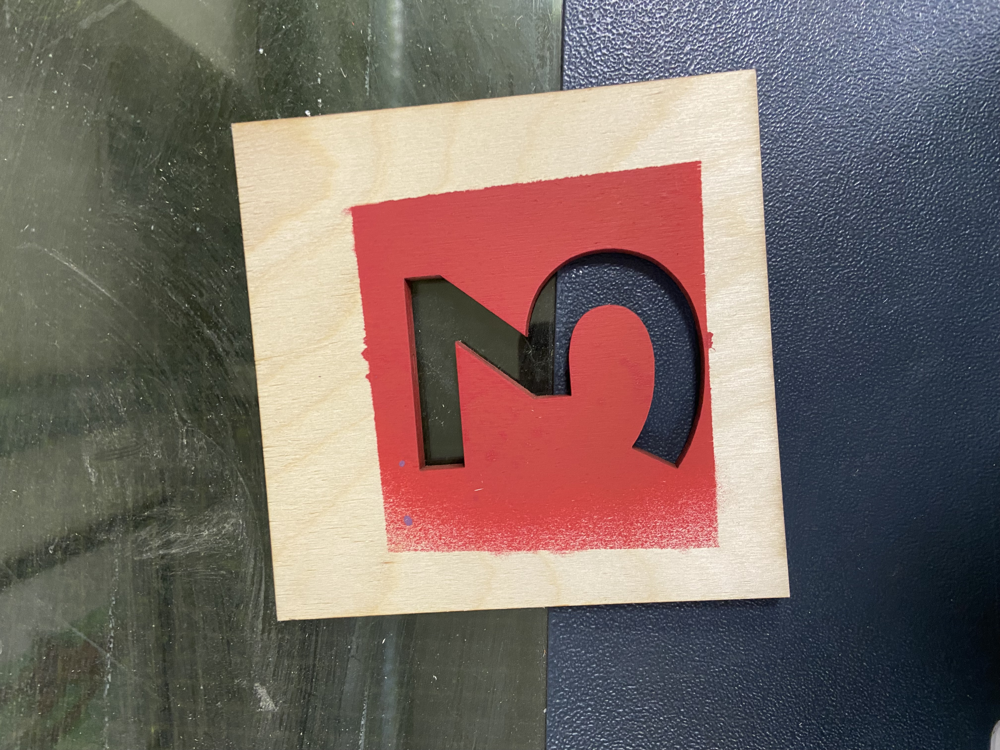
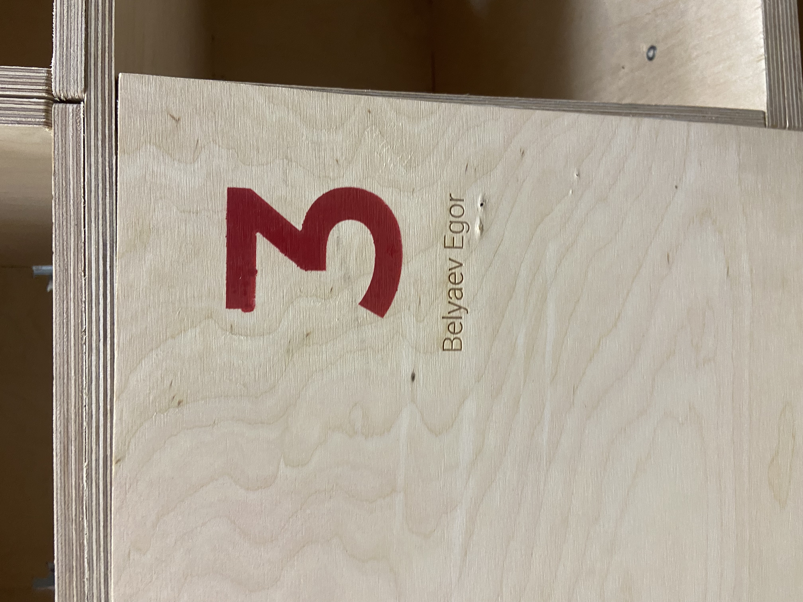
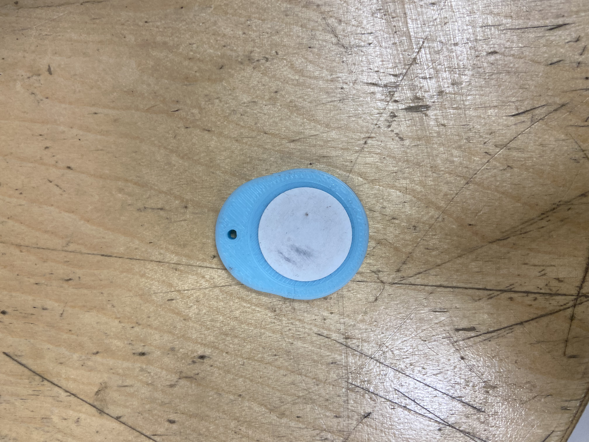
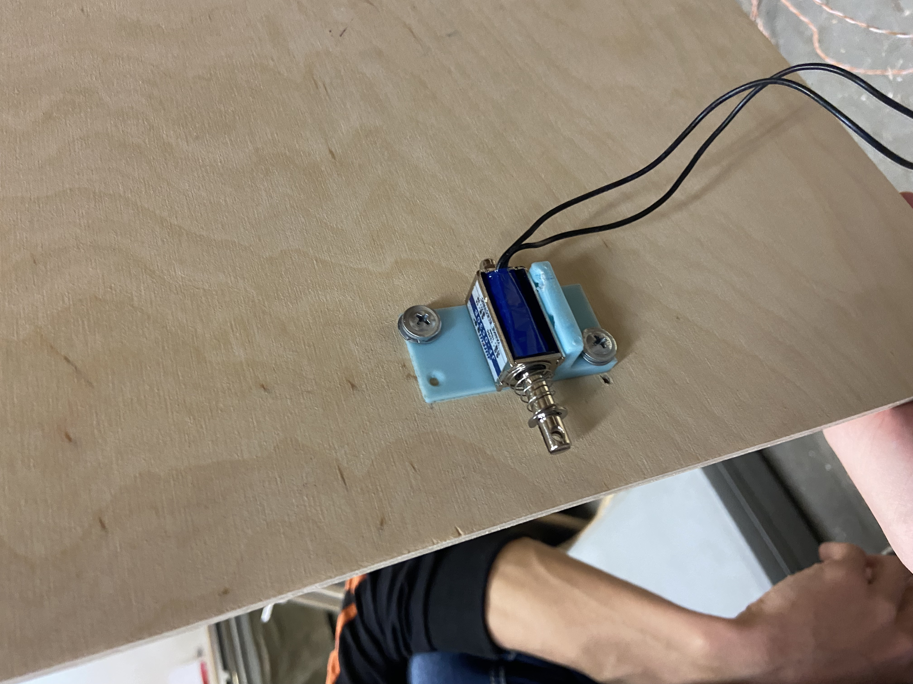
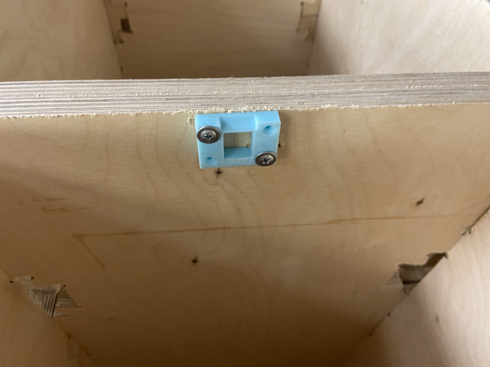
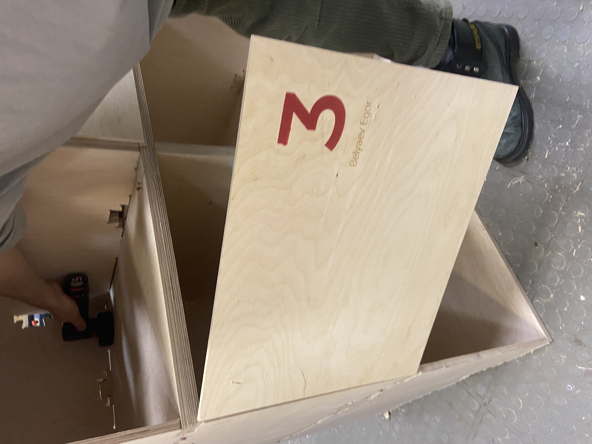
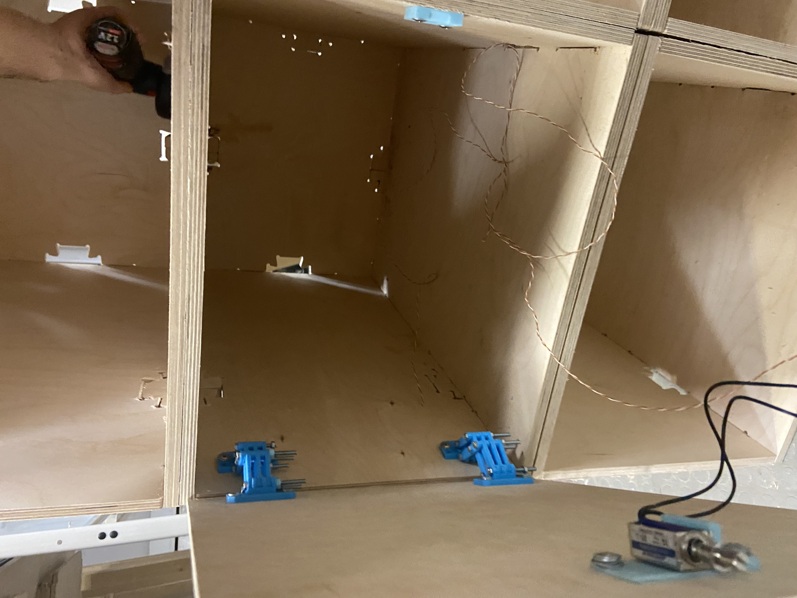

# Personal-Locker
Разработка и производство с помощью цифровых машин дверцы для персонального RFID-локера и аксессуара для RFID-метки
## СБорка локера
С помощью фрезерного станка были изготовлены стенки локера. На рисунке 1 представлен уже собранный персональный локер.

Рисунок 1 - Собранный локер

Также я занимался установкой колес (рисунок 2).

Рисунок 2 - Устанновленные колеса

## Крепежи для фиксации двери 
Для создания петель для локера была использованы 3д-модель из [Thingiverse](https://www.thingiverse.com/thing:2401035)
Для соеденения частей петли исполозовались болты М4 и гайки М4
Также были распечатаны недостающие гайки М4 на 3Д-принтере.

Рисунок 3 - Собранная петля и гайки

## Производство двери
Для производства двери был использован фрезерный станок и 6 мм фанера
С помощью программы ArtCAM, которая задает работу фрезерного станка, была спроектирована дверца с размерами 44х35 мм
Полсе изготовления дверца была отшлифована

Рисунок 4 - Готовая дверца

## Индексация двери 
После изготовления дверь была пронумерована
Мой порядковый номер "3"
Для этого на лазерном станке из фанеры 3 мм мы вырезали трафарет

Рисунок 5 - Трафарет

После на дверцу с помощью вырезаного трафарета и балончика с краской была нанесена маркировка
После высахания гравировкой с помощью лазерного станка было добавлено имя 

Рисунок 6 - Пронумерованная именная дверь

## Разработка RFID-аксессуара
Был разработан брелок на ключи на 3Д-принтере из PLA
Модель была сделана в SolidWorks

Рисунок 7 - Модель в SolidWorks

Рисунок 8 - Готовый аксессуар

## Установка замка 
Замок состоит из соленоида и проводов, а также креплений для него 
Крепеж для соленоида был распечатан на 3Д-принетере
Провода были спаяны с соленоидом, спай был изолирован термоусадкой 

Рисунок 9 - Прикрепленный соленоид

Рисунок 10 - Установленный замок 

## Результат

Рисунок 11 - Результат

## Недостатки и косяки
* Дверь под силой тяжести кривится
* Неправильно установлены петли, лучше установить их по большей длине снизу, сделать локет, который открывается сверху
* Неправильно расчитанные шайбы, дефекты на лицевой стороне дверцы

